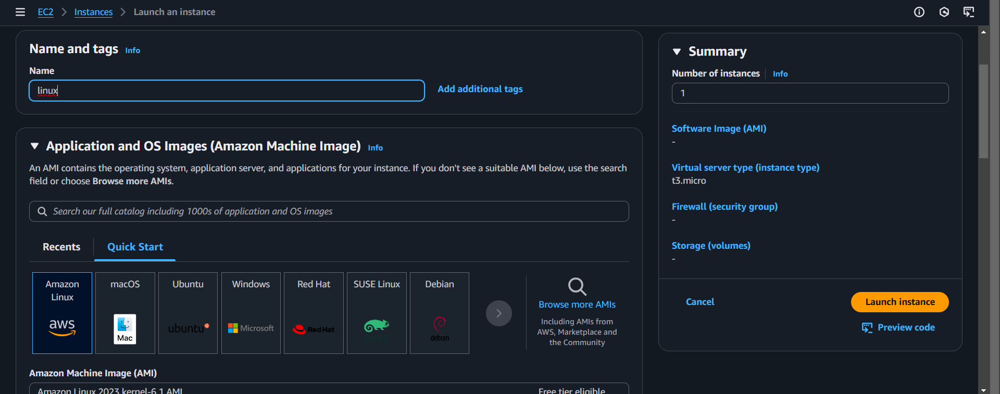
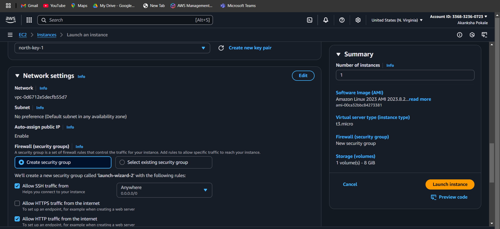
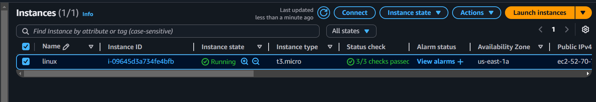
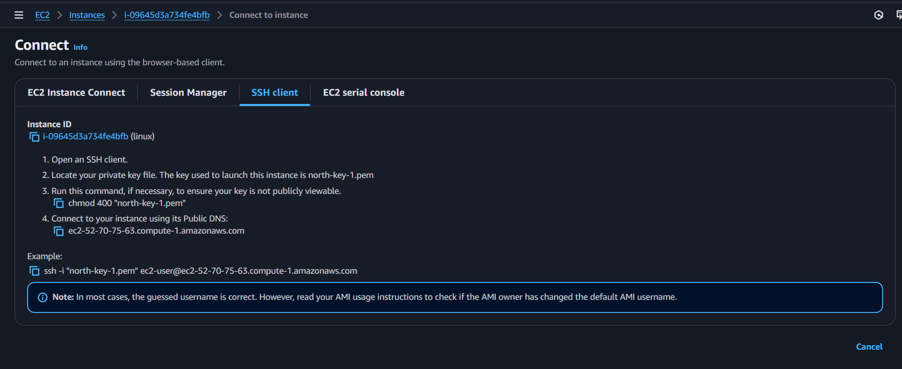
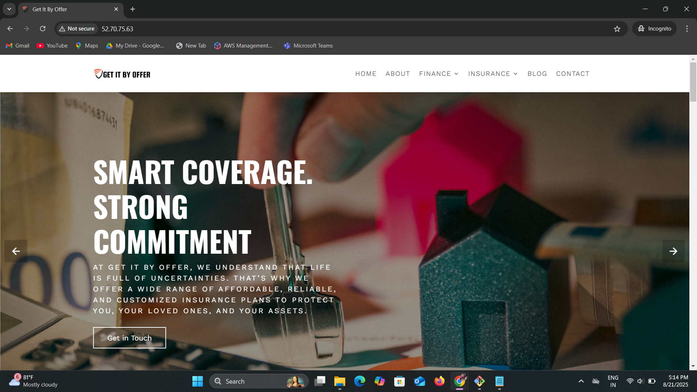

# Static Website Deployment on AWS EC2 using nginx Webserver

## Introduction

This project represents the process of deploying a static website on Amazon Linux EC2 instance using nginx webserver. The process includes how to set up a server, configure a web server, and make their website accessible to the public.

## Prerequisites
Before getting started, make sure you have:

1) An AWS account
2) Amazon linux EC2 instance
3) SSH key pair
4) A static website files ready for deployment.

## Deployment Steps
### Step 1: Launch EC2 instance

1) select AMI - Amazon Linux 2 and name for that instance  
2) select instance type - t3.micro for free tier  
3) If you already have a SSH key pair then select it otherwise create a new one.  
4) Create a security group and allow SSH traffic (port 22) and HTTP traffic (port 80) 
5) Click on Launch Instance.
    

### Step 2: Copying Static Website files from local machine to EC2

    
    scp -i <private-key> -r <folder_name/> ec2-user@public_IP:/home/ec2-user
    # to copy folder from local machine to EC2 

###  Step 3: Connect to the Instance

Use SSH to log in 
    

Click on connect 

1) In SSH Client at example there is path copy that path and paste it on git bash. 

    ### or 

    type a command

        ssh -i your-key.pem ec2-user@your-ec2-public-ip

### step 4: Install and Configure webserver nginx

    use the commands 
        
        sudo yum update
        sudo yum install nginx -y
        sudo systemctl start nginx
        sudo systemctl enable nginx
        sudo systemctl status nginx
    

### step 5: Deploying website files

    #copy all files of website to nginx default directory
    sudo cp -r dir_name/* /usr/share/nginx/html
    cd /usr/share/nginx/html
    ls

### Step 6: Testing Deployment

    # To check on ec2-user
    curl localhost

### Step 7: Access the website 
Open a browser and enter your EC2 public IP to view the website.

## Summary

This project covers a detailed how-to for setting up a static website on Amazon Linux EC2. Launching an EC2 instance, installing and configuring a web server (nginx), setting up security groups with the required inbound rules, and releasing website files for the public to view are all described. This is the first time I have successfully deployed a website from start to end in the cloud.